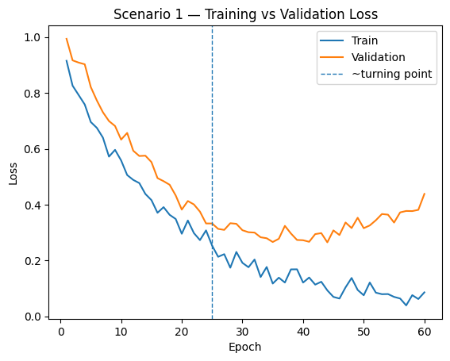
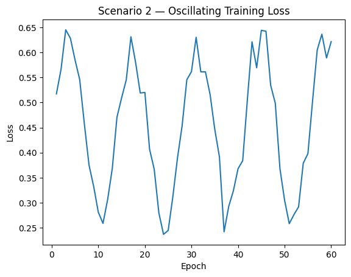
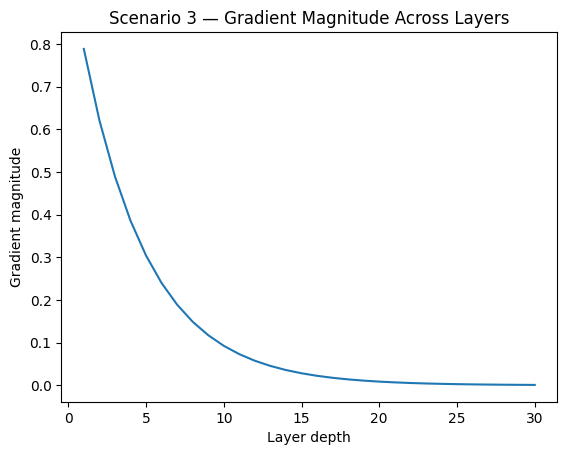

# AI Engineering Scenarios 

> **Instructions:** For each scenario, analyze the plot(s), diagnose the issue, and propose concrete engineering actions.
> You may assume a standard supervised learning setup with train/validation splits.

---

## Scenario 1 — Generalization breakdown (possible overfitting)

**Context:** You trained a model for a real business classification task (e.g., churn or fraud). You logged the training and validation loss across epochs.

### Questions
1. **Diagnose** what is happening around epoch ~25 (use the plot evidence).
**R/** Around epoch 25, the validation loss begins to trend upward, while the training loss continues to decrease. This divergence happens becauses the model is losing its ability to generalize to unseen data.
2. Is this **overfitting, underfitting, or neither**? Justify.
**R/** This is overfitting. The model is effectively memorizing the specific patterns of the training set (indicated by the falling blue line) at the expense of learning generalizable features that apply to the validation set (indicated by the rising orange line).
3. Propose **three** interventions you would try **in order** (be specific: early stopping, L2, dropout, data augmentation, reduce capacity, more data, etc.).
**R/** First, the inmediate fix would be an early stopping. This would immediately help by halting the training process at the moment when the validation loss reaches its lowest point, which is usually when the model is generalizing most effectively. Then, I would add a L2 Regularization. This effectively penalizes excessively large weights and contributes to narrowing the gap between training and validation performance. And, finally, I would increase the diversity of the training set so the model has a harder time memorizing specific samples and is forced to learn more robust features.
4. If the metric you ultimately care about is **F1** (not loss), what additional plots/metrics would you request before making a decision?
**R/** If the final goal is F1, I would request the F1 Score Curve, to see if the F1 peak actually coincides with the loss minimum, Precision and Recall curves to understand which component of the F1 score is degrading.And, Confusion Matrix, to identify if the model is struggling with specific class imbalances.
5. Write a short plan: **what would you implement today** vs **what would you investigate next week**?
**R/** 
**Today:** Implement an EarlyStopping callback monitoring val_loss with a patience of ~5-10 epochs and save the best model weights. 
**Next week:** Investigate data augmentation techniques or hyperparameter tuning to structurally improve generalization.

---

## Scenario 2 — Unstable optimization

**Context:** You are training a deep network using **vanilla SGD**. The training loss behaves as shown.

### Questions
1. What are the **two most likely** root causes (rank them)?
**R/** First, the learning rate could be too high. The optimizer is overshooting the local minima, causing the loss to bounce around the walls of the cost function. Second, the batch size could be too small. Extremely noisy gradients from tiny batches can cause the optimization path to look like a random walk rather than a descent.
2. What is the **first change** you would try? Explain why it is first.
**R/** The first change should be reducing the learning rate by a factor of 10. High learning rate is the most common cause of massive oscillations. It is the cheapest experiment to run to see if the loss stabilizes.
3. Would switching to **Momentum / RMSProp / Adam** help here? Explain the mechanism (not just “yes/no”).
**R/** Yes, these optimizers use a moving average of gradients. Momentum adds a fraction of the previous update to the current one, which reduces oscillations in directions with high curvature and speeds up progress along more consistent directions. Adam adds adaptive learning rates per parameter, effectively normalizing the step size.
4. Suggest a **diagnostic experiment** that can distinguish between “bad LR” vs “bad batch size / noisy gradients”.
I would perform a batch size vs. learning rate test, Keep the learning rate constant but increase the batch size significantly. If the oscillations significantly smooth out, the issue was noisy gradients (batch size). If the oscillations persist at the same magnitude, the issue is a bad learning rate.    
5. What would you log (signals) to confirm the fix worked?
A gradient norms, to monitor if gradients are becoming excessively large.And a weight update magnitude, to see the actual size of the steps being taken in parameter space.
---

## Scenario 3 — Backpropagation signal degradation (vanishing gradients)

**Context:** You are training a 30-layer MLP. You log the average gradient magnitude per layer (from output layer backward).

### Questions
1. Diagnose what phenomenon the plot suggests and why it happens (use the chain rule argument).
**R/** The plot shows Vanishing Gradients.
**Chain Rule Argument:** In a deep MLP, the gradient at a layer is the product of the gradients of subsequent layers. If these gradients are small (e.g., $< 1$), multiplying them 30 times results in a value that effectively rounds to zero:
$$\frac{\partial L}{\partial W_1} = \frac{\partial L}{\partial a_{30}} \cdot \frac{\partial a_{30}}{\partial a_{29}} \dots \frac{\partial a_2}{\partial a_1} \cdot \frac{\partial a_1}{\partial W_1}$$
2. Propose **three** model/architecture changes that directly target this (not optimizer-only suggestions).
**R/**
**I.** **Residual connections:** Provides a path for the gradient to bypass layers without being diminished.
**II.** **Batch normalization:** Keeps activations in a range that prevents saturation of non-linearities.
**III.** **Architectural Depth Reduction:** If the task does not require 30 layers, simplifying the model can naturally alleviate the vanishing problem.
3. Would changing the optimizer alone (e.g., Adam) solve it? Why/why not?
**R/** No. While Adam scales updates, it cannot recover a signal that has mathematically vanished to zero. If the gradient is $10^{-10}$, scaling it up just amplifies numerical noise.
4. If you must keep the depth, what would you do with **initialization** and **activations**?
**R/**  For initialization, I would use Xavier (Glorot) or He (Kaiming) initialization to maintain the variance of the signal across layers. Fpr activations, switch from Sigmoid or Tanh to ReLU (Rectified Linear Unit), as its derivative is 1 for all positive inputs, preventing saturation.
5. What evidence (additional plot/log) would you collect to confirm the diagnosis?
**R/** A Gradient Norms per Layer, as shown in the scenario, logging the magnitude of gradients at each layer during training. Also, a histogram of Activations, to check if layers are becoming "saturated" (all outputs near 0 or 1 for Sigmoid).

---

## Optional (bonus) — Short technical writing
Pick **one** scenario and write a short “incident report” (max 10 lines) including:
- Symptom
- Probable cause
- Immediate mitigation
- Longer-term fix

**R/** **Scenario 3**
**Symptom:** Gradient magnitude effectively hits zero before reaching the initial layers.

**Probable cause:** High depth combined with saturating activation functions (Sigmoid/Tanh) causing multiplicative signal decay via the chain rule.

**Immediate mitigation:** Replace Sigmoid/Tanh activations with ReLU and implement He Initialization.

**Longer-term fix:** Introduce residual connections (skip connections) to ensure a stable gradient flow throughout the architecture.