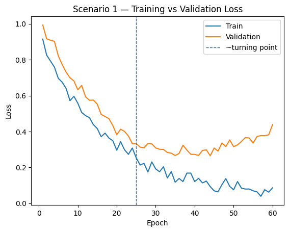
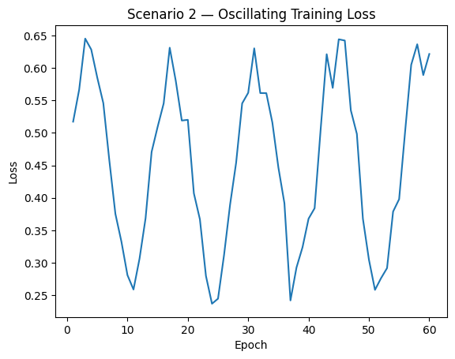

# AI Engineering Scenarios 

> **Instructions:** For each scenario, analyze the plot(s), diagnose the issue, and propose concrete engineering actions.
> You may assume a standard supervised learning setup with train/validation splits.

---

## Scenario 1 — Generalization breakdown (possible overfitting)

**Context:** You trained a model for a real business classification task (e.g., churn or fraud). You logged the training and validation loss across epochs.

### Questions
1. **Diagnose** what is happening around epoch ~25 (use the plot evidence).
2. Is this **overfitting, underfitting, or neither**? Justify.
3. Propose **three** interventions you would try **in order** (be specific: early stopping, L2, dropout, data augmentation, reduce capacity, more data, etc.).
4. If the metric you ultimately care about is **F1** (not loss), what additional plots/metrics would you request before making a decision?
5. Write a short plan: **what would you implement today** vs **what would you investigate next week**?

---

## Scenario 2 — Unstable optimization

**Context:** You are training a deep network using **vanilla SGD**. The training loss behaves as shown.

### Questions
1. What are the **two most likely** root causes (rank them)?
2. What is the **first change** you would try? Explain why it is first.
3. Would switching to **Momentum / RMSProp / Adam** help here? Explain the mechanism (not just “yes/no”).
4. Suggest a **diagnostic experiment** that can distinguish between “bad LR” vs “bad batch size / noisy gradients”.
5. What would you log (signals) to confirm the fix worked?

---

## Scenario 3 — Backpropagation signal degradation (vanishing gradients)

**Context:** You are training a 30-layer MLP. You log the average gradient magnitude per layer (from output layer backward).

### Questions
1. Diagnose what phenomenon the plot suggests and why it happens (use the chain rule argument).
2. Propose **three** model/architecture changes that directly target this (not optimizer-only suggestions).
3. Would changing the optimizer alone (e.g., Adam) solve it? Why/why not?
4. If you must keep the depth, what would you do with **initialization** and **activations**?
5. What evidence (additional plot/log) would you collect to confirm the diagnosis?

---

## Optional (bonus) — Short technical writing
Pick **one** scenario and write a short “incident report” (max 10 lines) including:
- Symptom
- Probable cause
- Immediate mitigation
- Longer-term fix
